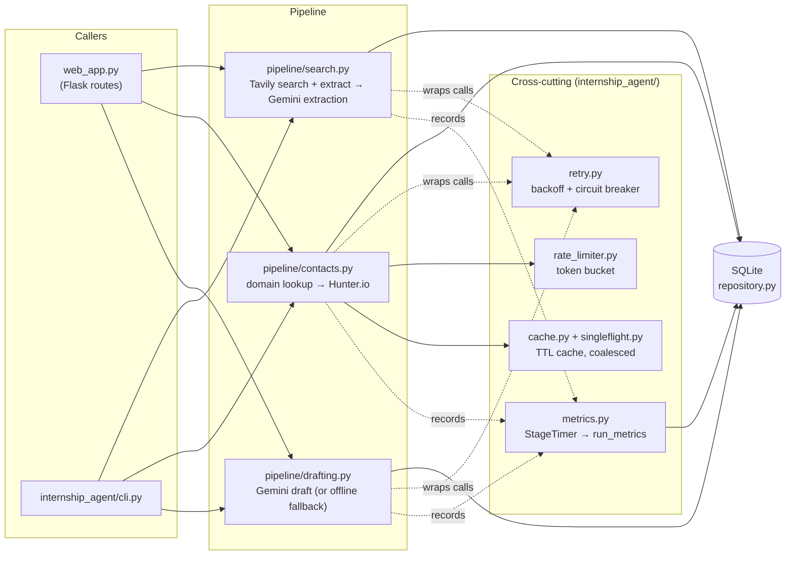
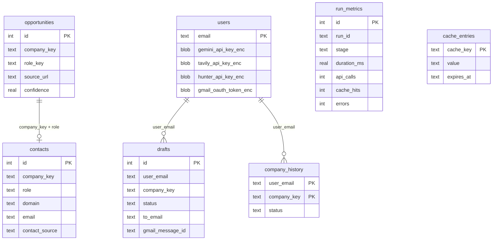

# Architecture

## Pipeline

Three stages, each an independent function in `internship_agent/pipeline/`, sharing one SQLite database through `internship_agent/repository.py`. The web app and the CLI are both thin callers of the same pipeline — neither has its own copy of the logic.



Each stage runs its own bounded `ThreadPoolExecutor` over the items it's processing (URL batches for extraction, companies for contact resolution, contacts for drafting) instead of the original sequential loop. See [Concurrency](#concurrency) for why that's safe.

## Storage

SQLite in WAL mode, not a flat JSON file per collection. The earlier version rewrote an entire JSON file (`data/internships.json`, `data/contacts.json`, one `data/drafts_<user>.json` and `data/history/<user>.json` per user) on every single mutation — no indexing, no partial writes, and a search re-run silently *replaced* the whole leads list instead of accumulating it.



`opportunities` and `contacts` are unique on `(company_key, role_key)` / `(company_key, role)` and inserted with `INSERT ... ON CONFLICT DO NOTHING` / `DO UPDATE`, so leads accumulate across runs instead of being replaced, and re-running search or contact resolution is idempotent. Drafts are addressed by database id rather than list position — the old `index`-based addressing from the JSON-array days was one stale response away from acting on the wrong draft.

`internship_agent/db.py` gives each thread its own connection to the same file (SQLite connections aren't safe to share across threads); WAL mode lets those connections read concurrently and serializes writers without blocking readers, which matters once contact resolution and drafting are running on thread pools.

## Concurrency

`pipeline/contacts.py` and `pipeline/drafting.py` submit their per-item work to a `ThreadPoolExecutor`. This is safe because:

- **Storage** — every worker gets its own SQLite connection (see above); there's no shared cursor or connection object to race on.
- **Cache counters** — `cache.py`'s hit/miss counters are incremented under a `threading.Lock`, not bare `+=`, which isn't atomic across threads in CPython.
- **Cache reads/writes** — this one *wasn't* safe on the first pass. Dispatching a batch to the pool means two workers can land on the same cache key (e.g. two roles at the same company) before either has written a result back: both miss the cache and both pay for the same Tavily + Gemini domain lookup. A concurrency test (`tests/integration/test_contacts_pipeline.py::test_domain_lookup_is_cached_across_roles_at_the_same_company`) caught this by asserting call counts, not just correctness of the returned data. The fix is `singleflight.py`: concurrent callers for the same key queue behind whichever one gets there first, so the work only happens once per key per batch.
- **Metrics** — worker threads return their own call/cache/error counts rather than mutating a shared `StageTimer` from multiple threads; the results are aggregated in the main thread as futures complete (`as_completed` naturally runs in the calling thread), which sidesteps the same non-atomic-increment problem without needing a lock in the hot path.

`benchmarks/bench_concurrency.py` measures the resulting speedup against fake clients with a fixed simulated per-call latency, so the number is reproducible without live API rate limits or keys:

```text
companies: 20, simulated latency: 0.30s/call
sequential (1 worker):    18.26s
concurrent (5 workers):    3.66s
speedup:                   4.99x
```

(Real speedup on live APIs will be lower than the ~5x here, since 5 workers hitting a real rate-limited API will spend some of that concurrency waiting on `rate_limiter.py` instead of the network — this benchmark isolates the thread-pool effect specifically.)

## Resilience

Every external call (Tavily, Gemini, Hunter.io, Gmail) goes through `retry_with_backoff` (exponential backoff with jitter, bounded attempts) and an optional `CircuitBreaker`. One detail that took a rewrite to get right: the breaker check has to sit *outside* the retried function, not inside it. The first version checked `breaker.before_call()` inside the `@retry_with_backoff`-wrapped method, so once the breaker opened, `CircuitOpenError` was itself treated as a retryable exception — retrying against a circuit that just said "stop calling this" for a full backoff cycle before finally giving up. `tests/unit/test_clients.py` asserts the underlying client is called exactly `failure_threshold` times, not more, which is what caught it.

Hunter.io calls additionally share a `TokenBucketRateLimiter` (`rate_limiter.py`) across all worker threads, since Hunter's free tier rate limit is per-account, not per-thread — uncoordinated concurrent workers would just turn concurrency into a wall of 429s.

## Observability

`metrics.py`'s `StageTimer` wraps each pipeline stage execution and records start/end time, item counts, API call count, cache hits, and errors to `run_metrics`. `aggregate_stats()` rolls that up into per-stage p50/p95 latency, cache hit rate, and error rate, exposed at `GET /api/stats` and the in-app Stats page. Previously the only signal available was `print()` output scrolling by in a terminal.

## Security

- **API keys and the Gmail OAuth token are encrypted at rest** (`crypto.py`, Fernet / AES-128-CBC + HMAC-SHA256), keyed off `INTERNSHIP_AGENT_SECRET_KEY`. The BYO-key model means real, usable API keys for every signed-in user live on this server for as long as they're signed in; the previous version stored them as plaintext JSON.
- **Gmail OAuth token is now scoped per user.** It used to live in one shared `data/web_google_token.json` for *every* signed-in user — a second Google account signing in on the same server would overwrite the first account's send credentials, and a pending "approve and send" from the first user would then send through the second user's Gmail. `users.gmail_oauth_token_enc` fixes that.
- SQL is fully parameterized (no string-built queries) — see `repository.py`.

## Known limitations / follow-ups

Being direct about what this is and isn't:

- SQLite is the right choice for a single-host app like this one, not for a service that needs to scale writes across multiple hosts — that would mean Postgres and a connection pool, not a bigger version of this design.
- The pipeline runs synchronously inside the Flask request/response cycle (parallel *within* a stage, but the HTTP request still blocks until the stage finishes). A production version handling longer-running or higher-volume runs would move this to a background task queue (Celery/RQ + Redis) with a job-status endpoint the UI polls, instead of holding the connection open.
- `google-generativeai` is EOL upstream in favor of `google-genai`; not migrated in this pass since it's an unrelated SDK swap, not a systems change — tracked here rather than silently left for someone to discover.
- No structured request tracing (e.g. OpenTelemetry) — `run_metrics` covers pipeline-stage timing, not per-HTTP-request tracing.
