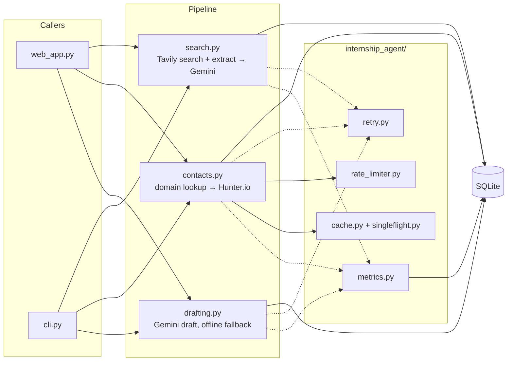
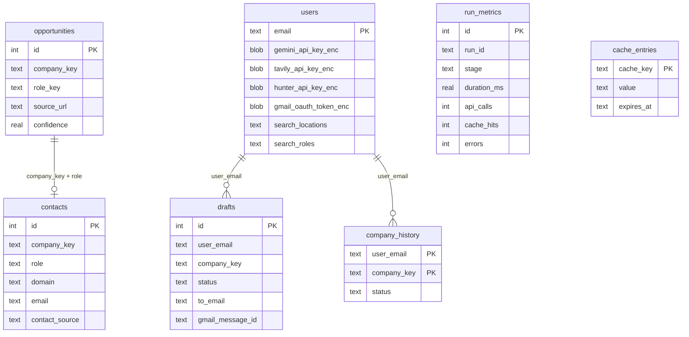

# Architecture

## Pipeline

Three stages in `internship_agent/pipeline/`, sharing one SQLite database through `repository.py`. Both `web_app.py` and `cli.py` call the same pipeline functions — no duplicated logic between the two entry points.



Each stage runs its own bounded `ThreadPoolExecutor` (URL batches for extraction, companies for contact resolution, contacts for drafting), instead of the original's sequential loop.

## Storage

SQLite, WAL mode. Previously each collection was its own JSON file (`internships.json`, `contacts.json`, one `drafts_<user>.json` / `history/<user>.json` per user), rewritten wholesale on every mutation — no indexes, and a search re-run replaced the whole leads list instead of accumulating it.



`opportunities`/`contacts` are unique on `(company_key, role_key)` / `(company_key, role)`, inserted with `ON CONFLICT DO NOTHING` / `DO UPDATE` — leads accumulate across runs and re-running a stage is idempotent. Drafts are addressed by row id, not list position.

`db.py` gives each thread its own connection (SQLite connections aren't shared across threads); WAL lets those connections read concurrently without blocking writers.

## Concurrency

`contacts.py` and `drafting.py` submit per-item work to a thread pool. Notes from getting this right:

- Cache hit/miss counters (`cache.py`) are incremented under a lock — bare `+=` on a shared counter isn't atomic across threads in CPython.
- Domain-lookup caching wasn't safe on the first pass: two workers resolving different roles at the same company can both miss the cache before either writes back, so both pay for the same Tavily + Gemini call. `tests/integration/test_contacts_pipeline.py::test_domain_lookup_is_cached_across_roles_at_the_same_company` catches this by asserting call counts, not just correctness. Fix is `singleflight.py` — concurrent callers for the same key queue behind whichever one gets there first.
- `StageTimer` counters aren't touched from worker threads directly. Each worker returns its own call/cache/error counts; the main thread aggregates them as futures complete (`as_completed` runs in the calling thread), which avoids needing a lock in the hot path.

`benchmarks/bench_concurrency.py` measures the thread-pool effect against fake clients with a fixed simulated per-call latency (reproducible without live keys or rate limits):

```
20 companies, 0.3s/call simulated latency
sequential (1 worker):   18.26s
concurrent (5 workers):   3.66s
speedup:                  4.99x
```

Real speedup on live APIs will be lower — 5 workers against a rate-limited API spend some of that concurrency waiting on `rate_limiter.py` rather than the network. This benchmark isolates the thread-pool effect specifically.

## Resilience

Every external call (Tavily, Gemini, Hunter.io, Gmail) goes through `retry_with_backoff` plus an optional `CircuitBreaker`. The breaker check sits outside the retried function, not inside it — an earlier version checked `before_call()` inside the retry-wrapped method, so once the breaker opened, `CircuitOpenError` itself got retried for a full backoff cycle before giving up. `tests/unit/test_clients.py` asserts the underlying client is called exactly `failure_threshold` times, not more.

Hunter.io calls share a `TokenBucketRateLimiter` across worker threads — Hunter's rate limit is per-account, not per-thread.

## Observability

`StageTimer` wraps each stage execution and records timing, item counts, API calls, cache hits, and errors to `run_metrics`. `aggregate_stats()` rolls that into per-stage p50/p95 latency, cache hit rate, and error rate — exposed at `GET /api/stats` and the Stats page. Previously the only signal was stdout.

## Security

- BYO API keys and the Gmail OAuth token are encrypted at rest (`crypto.py`, Fernet), keyed off `INTERNSHIP_AGENT_SECRET_KEY`. They were plaintext JSON before.
- Gmail OAuth token is scoped per user (`users.gmail_oauth_token_enc`). It used to live in one shared file for every signed-in user — a second Google account signing in would overwrite the first account's send credentials.
- SQL is parameterized throughout, no string-built queries.

## Search scope

`pipeline/search.py` builds queries from user-supplied locations and roles (`_build_queries`), capped at `MAX_SEARCH_QUERIES` regardless of how many are selected. Empty locations/roles fall back to "any location" / a small set of default tech-role terms — no filtering, not "Singapore only" as in the original.

## Lead ranking

`ranking.py`. Before drafting, candidates are scored and sorted so the batch fills with the best matches first, instead of arbitrary order:

- **Features** (`extract_features`): TF-IDF cosine similarity between the resume and the role/description text, a contact-quality signal (a real Hunter.io contact beats a guessed `careers@` address), and the extraction confidence Gemini reported for the listing.
- **Cold start**: with no history, `LeadRanker` scores candidates with a hand-weighted sum of those same features (weighted toward text similarity) — no model needed yet.
- **Learned**: once a user has at least `MIN_TRAINING_EXAMPLES` decided drafts (sent/skipped/removed) with at least a few examples of each outcome, it trains a logistic regression on that history instead, mapping features to "did I actually send this one." Retrains from scratch on every call — the training set is one user's own history (tens to low hundreds of rows at most), so retraining is cheap and there's no persisted model to go stale.
- **Evaluation** (`benchmarks/eval_ranker.py`): since a real user's history doesn't exist until they've used the app, this evaluates the same feature/model code on a synthetic labeled set — 15 backend/ML-leaning role templates labeled positive, 15 sales/marketing-leaning templates labeled negative, against a backend-leaning resume, with contact-quality/confidence randomized independent of label so the eval actually stresses the text-similarity feature rather than being trivially solved by one field. Train/test split, scored by ROC-AUC (0.5 = random, 1.0 = perfect separation):

  ```
  training examples: 60, held-out: 60
  ROC-AUC: 0.784
  ```

## Limitations

- SQLite fits a single-host app. A service that needs to scale writes across multiple hosts needs Postgres and a connection pool — not a bigger version of this.
- The pipeline runs inside the Flask request/response cycle — parallel within a stage, but the HTTP request blocks until the stage finishes. Longer-running or higher-volume use would move this to a background queue (Celery/RQ + Redis) with a job-status endpoint the UI polls.
- `google-generativeai` is EOL upstream in favor of `google-genai`; not migrated here since it's an unrelated SDK swap.
- No per-request tracing (OpenTelemetry) — `run_metrics` covers pipeline-stage timing, not HTTP-level tracing.
- TF-IDF cosine similarity has no semantic understanding — "backend" and "server-side" score as unrelated. Sentence embeddings would generalize better; TF-IDF was chosen to keep ranking fully local (no extra API calls/cost per candidate scored). The 3-feature logistic regression is deliberately simple, not under-built: a per-user training set of tens to low hundreds of examples can't support a much larger model without overfitting.
