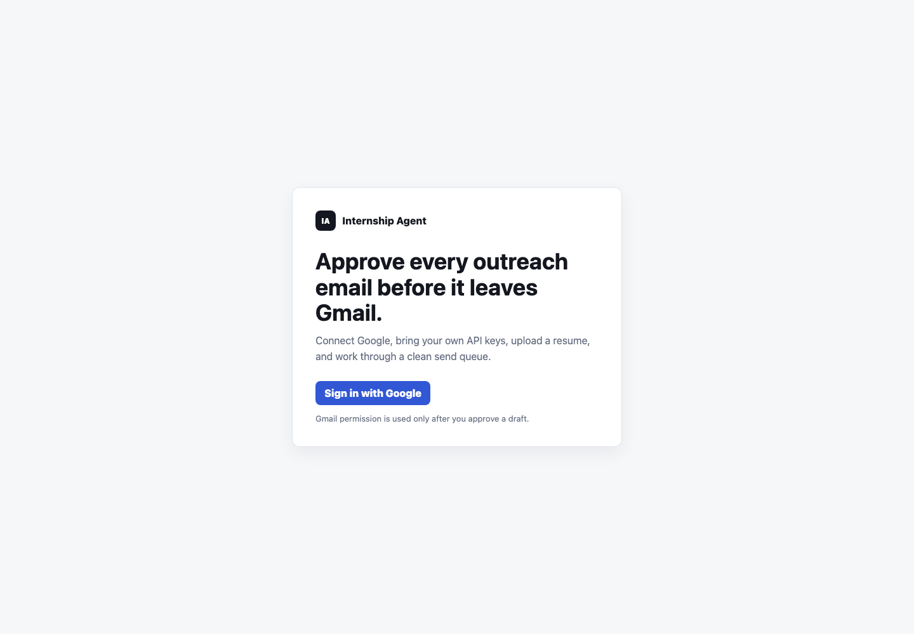
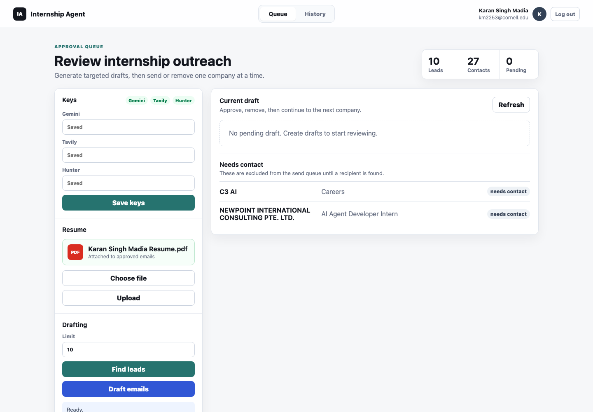
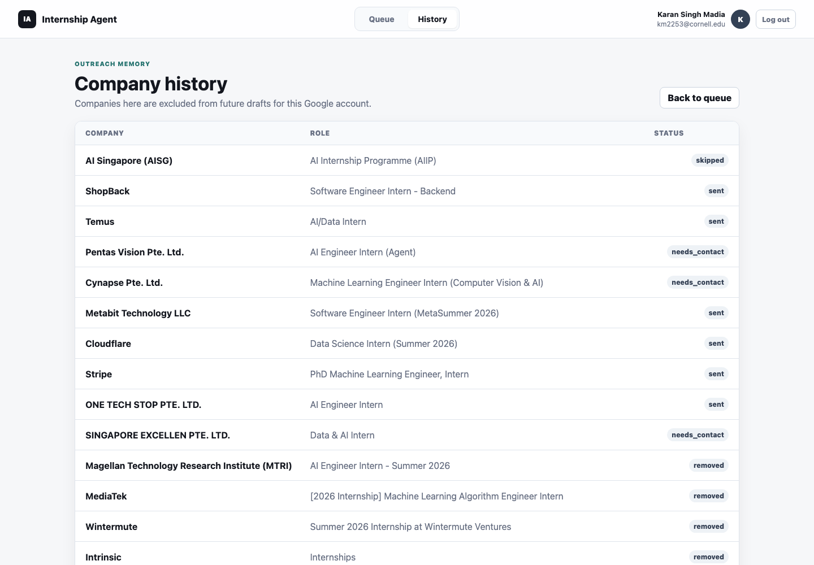

# Internship Agent

A local web app for finding AI, tech, and CS internships in Singapore, drafting outreach emails from a resume, and sending each email only after explicit user approval.

The app uses each user's own Google account for Gmail sending and their own API keys for search and drafting. Nothing sends automatically.

## Screenshots

### Sign in



### Approval queue



### Company history



## What It Does

The web app runs an approval-first outreach workflow:

1. Sign in with Google so the app can send from your Gmail account.
2. Add your own Gemini and Tavily keys, plus an optional Hunter.io key.
3. Upload a resume PDF.
4. Find current internship leads.
5. Draft emails using the resume and company details.
6. Review one draft at a time.
7. Click `Send` or `Remove`.
8. Track company history so the same Google user does not draft the same company twice.

Drafts without a recipient are separated into `Needs contact` and are not sendable until a real email is found.

## Stack

- Python
- Flask
- Gemini API for drafting
- Tavily for web search
- Hunter.io for contact lookup
- Gmail API for approved sends

## Local Setup

Install dependencies:

```bash
venv/bin/pip install -r requirements.txt
```

Create or update Gmail OAuth credentials:

```bash
venv/bin/python internship_agent.py setup-gmail
```

That command asks for your downloaded Google OAuth client JSON and saves it as `credentials.json`. This file is ignored by git.

Start the web app:

```bash
venv/bin/python web_app.py
```

Open:

```text
http://127.0.0.1:5001
```

For local Google OAuth, your OAuth client needs this redirect URI:

```text
http://127.0.0.1:5001/oauth2callback
```

## Google OAuth: Cornell-Only / Organization Restricted Fix

If Google says the app is restricted to users inside your organization, the OAuth consent screen is set to `Internal`.

`Internal` means only users inside the Google Workspace organization that owns the Google Cloud project can authorize the app. If the project is under Cornell, that effectively means Cornell accounts only. Google's app audience docs describe `External` apps as available to any Google account and `Internal` apps as limited to the owning organization.

To let any Google account use it:

1. Open Google Cloud Console for the project that owns `credentials.json`.
2. Go to `Google Auth Platform` or `APIs & Services` -> `OAuth consent screen`.
3. Find `Audience` / `User type`.
4. Change the app from `Internal` to `External`.
5. While testing, add specific Google accounts as test users.
6. When you want it generally available, publish the app to production and complete Google verification if required.

The app uses the `gmail.send` scope because it only needs to send approved emails. Google classifies `gmail.send` as a sensitive scope, so public production usage may show an unverified warning or require OAuth verification.

If the Cornell-owned project does not let you switch to `External`, create a new personal Google Cloud project, enable Gmail API, configure the consent screen as `External`, create a new OAuth client, download its JSON, and rerun:

```bash
venv/bin/python internship_agent.py setup-gmail
```

## Bring Your Own Keys

The web app is designed to avoid the developer paying for everyone else's usage. Each signed-in user enters their own keys in the app:

- Gemini: required for drafting
- Tavily: required for search
- Hunter.io: optional, improves recipient discovery

Keys are saved locally under ignored data files for this development app. For a real hosted multi-user deployment, replace local file storage with a database and encrypted secret storage.

## CLI Workflow

The original command-line agent still works.

Run everything:

```bash
venv/bin/python internship_agent.py run --resume /absolute/path/to/resume.pdf --limit 15
```

Run step by step:

```bash
venv/bin/python internship_agent.py search --limit 25
venv/bin/python internship_agent.py contacts
venv/bin/python internship_agent.py draft --resume /absolute/path/to/resume.pdf --limit 25
venv/bin/python internship_agent.py send
```

The CLI send step previews each email:

```text
Send this email? [y]es / [n]o skip / [q]uit:
```

No email is sent unless you type `y` for that exact draft.

## Generated Files

Local generated files are ignored by git:

- `credentials.json`
- `token.json`
- `data/`
- `out/`
- `uploads/`
- `.env`

Useful runtime files include:

- `data/internships.json`
- `data/contacts.json`
- `data/drafts_<user>.json`
- `data/history/<user>.json`
- `out/email_drafts.json`

## Troubleshooting

If Gmail returns `403 Gmail API has not been used... or it is disabled`, enable Gmail API in the Google Cloud project that owns `credentials.json`, wait a few minutes, then try again.

If OAuth blocks non-Cornell or non-organization users, switch the OAuth app audience from `Internal` to `External`.

If OAuth blocks a specific test user while the app is in testing mode, add that Google account under test users in the OAuth consent screen.

If Gemini quota is hit while drafting, wait for the quota window to reset or use another Gemini API key. The app is BYO-key so quota is tied to the key currently saved for that user.

## References

- [Google Cloud: Manage app audience](https://support.google.com/cloud/answer/15549945)
- [Google Cloud: Requesting minimum scopes](https://support.google.com/cloud/answer/13807380)
