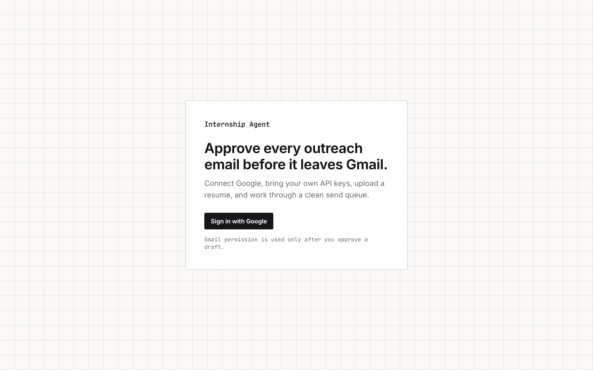
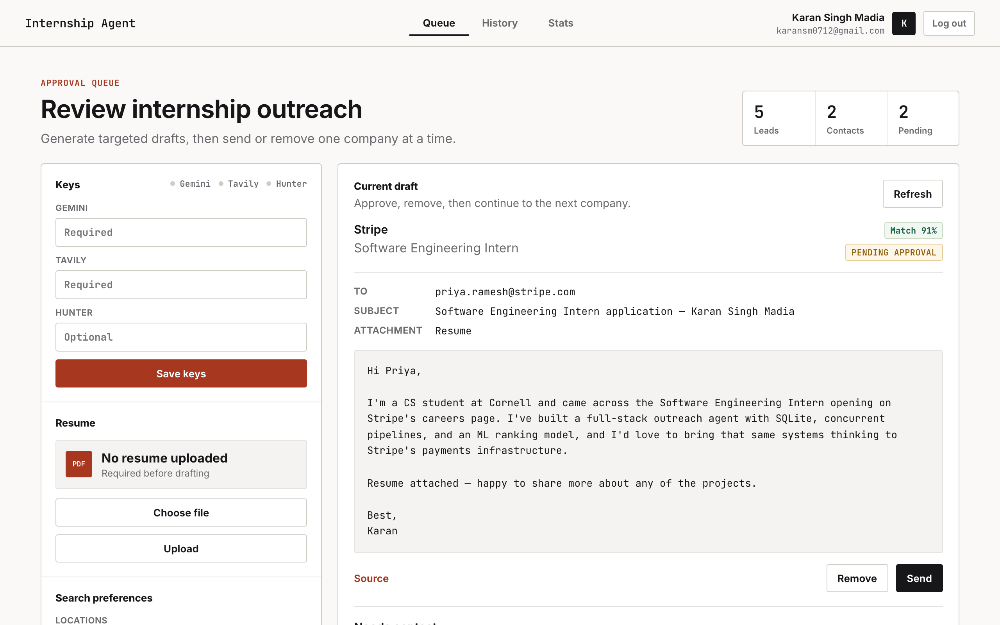
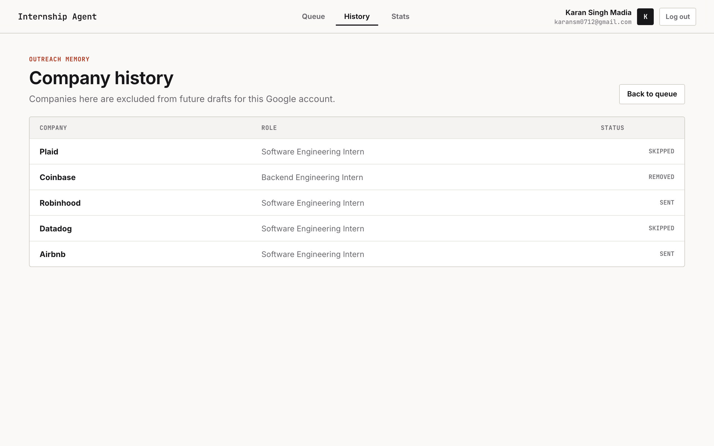

# Internship Agent

A search → contact-resolution → drafting pipeline for internship outreach, with a human-in-the-loop Gmail send step. Runs as a local web app or a CLI.

Each user brings their own Google account (for Gmail sending) and their own Gemini/Tavily/Hunter.io API keys — nothing sends automatically, and no email leaves without an explicit approval click.

[Architecture](ARCHITECTURE.md) has the schema, the pipeline diagram, and the design decisions behind each piece below.

## Screenshots

### Sign in



### Approval queue



### Company history



## What It Does

1. Sign in with Google so the app can send from your Gmail account.
2. Add your own Gemini and Tavily keys, plus an optional Hunter.io key.
3. Upload a resume PDF.
4. Find current internship leads.
5. Draft emails using the resume and company details.
6. Review one draft at a time.
7. Click `Send` or `Remove`.
8. Track company history so the same Google user does not draft the same company twice.

Drafts without a recipient are separated into `Needs contact` and are not sendable until a real email is found.

## Engineering

This started as a single 749-line script writing flat JSON files. The current version:

- **Storage**: a normalized SQLite schema (5 tables, indexed on the lookup columns, WAL mode for concurrent readers/writers) instead of rewriting whole JSON files on every mutation. BYO API keys and the Gmail OAuth token are encrypted at rest (Fernet), not plaintext — the old version stored them as plaintext JSON, and additionally kept the Gmail token in one file shared by *every* signed-in user, so a second Google account signing in could silently take over the first account's send credentials. Both are fixed; see [ARCHITECTURE.md](ARCHITECTURE.md#security).
- **Concurrency**: contact resolution and drafting run on bounded thread pools instead of a sequential loop with `time.sleep()` between every company. Benchmarked with reproducible simulated API latency (`benchmarks/bench_concurrency.py`, no network or API keys needed to run it):

  ```text
  companies: 20, simulated latency: 0.30s/call
  sequential (1 worker):    18.26s
  concurrent (5 workers):    3.66s
  speedup:                   4.99x
  ```

- **Resilience**: every external call (Tavily, Gemini, Hunter.io, Gmail) is wrapped in retry-with-exponential-backoff, and a circuit breaker fails fast once a dependency is down instead of continuing to retry it. Domain-lookup results are cached (TTL) and single-flighted, so concurrent workers can't stampede the same cache key — a real race a concurrency test caught during development (two threads resolving the same company's domain could both miss the cache before either wrote back).
- **Observability**: every pipeline run records per-stage latency (p50/p95), API call counts, cache hit rate, and error rate to SQLite, surfaced at `/api/stats` and the in-app **Stats** page.
- **Testing**: 180 pytest tests (unit, integration with mocked external APIs, and Flask route tests) at 87% coverage, clean under `ruff` and `mypy`. CI runs the full suite plus a Docker build on Python 3.11–3.13.

## Stack

- Python, Flask
- SQLite (storage) — see [ARCHITECTURE.md](ARCHITECTURE.md)
- Gemini API for extraction and drafting
- Tavily for web search
- Hunter.io for contact lookup
- Gmail API for approved sends

## Local Setup

Install dependencies (or `requirements-dev.txt` to also get pytest/ruff/mypy):

```bash
python3 -m venv .venv && source .venv/bin/activate
pip install -r requirements-dev.txt
```

Set an encryption key for stored API keys/tokens (falls back to an insecure dev default with a warning if unset — fine for `localhost`, not for anything shared):

```bash
export INTERNSHIP_AGENT_SECRET_KEY=$(python -c "import secrets; print(secrets.token_urlsafe(32))")
```

Create or update Gmail OAuth credentials:

```bash
python -m internship_agent setup-gmail
```

That command asks for your downloaded Google OAuth client JSON and saves it as `credentials.json`. This file is ignored by git.

Start the web app:

```bash
python web_app.py
```

Open:

```text
http://127.0.0.1:5001
```

For local Google OAuth, your OAuth client needs this redirect URI:

```text
http://127.0.0.1:5001/oauth2callback
```

### Docker

```bash
docker compose up --build
```

Serves the same app on `http://localhost:5001`, backed by a SQLite file under `./data` on the host. Set `FLASK_SECRET_KEY` / `INTERNSHIP_AGENT_SECRET_KEY` in your shell first if you want anything other than the dev defaults.

## Google OAuth: Cornell-Only / Organization Restricted Fix

If Google says the app is restricted to users inside your organization, the OAuth consent screen is set to `Internal`.

`Internal` means only users inside the Google Workspace organization that owns the Google Cloud project can authorize the app. If the project is under Cornell, that effectively means Cornell accounts only. Google's app audience docs describe `External` apps as available to any Google account and `Internal` apps as limited to the owning organization.

To let any Google account use it:

1. Open Google Cloud Console for the project that owns `credentials.json`.
2. Go to `Google Auth Platform` or `APIs & Services` -> `OAuth consent screen`.
3. Find `Audience` / `User type`.
4. Change the app from `Internal` to `External`.
5. While testing, add specific Google accounts as test users.
6. When you want it generally available, publish the app to production and complete Google verification if required.

The app uses the `gmail.send` scope because it only needs to send approved emails. Google classifies `gmail.send` as a sensitive scope, so public production usage may show an unverified warning or require OAuth verification.

If the Cornell-owned project does not let you switch to `External`, create a new personal Google Cloud project, enable Gmail API, configure the consent screen as `External`, create a new OAuth client, download its JSON, and rerun:

```bash
python -m internship_agent setup-gmail
```

## Bring Your Own Keys

The web app is designed to avoid the developer paying for everyone else's usage. Each signed-in user enters their own keys in the app:

- Gemini: required for drafting
- Tavily: required for search
- Hunter.io: optional, improves recipient discovery

Keys and the Gmail OAuth token are encrypted at rest in SQLite (see [ARCHITECTURE.md](ARCHITECTURE.md#security)), scoped per signed-in Google account.

## CLI Workflow

The original command-line agent still works, now as `python -m internship_agent`:

```bash
python -m internship_agent run --resume /absolute/path/to/resume.pdf --limit 15
```

Run step by step:

```bash
python -m internship_agent search --limit 25
python -m internship_agent contacts
python -m internship_agent draft --resume /absolute/path/to/resume.pdf --limit 25
python -m internship_agent send
python -m internship_agent stats   # print aggregate pipeline metrics
```

The CLI send step previews each email:

```text
Send this email? [y]es / [n]o skip / [q]uit:
```

No email is sent unless you type `y` for that exact draft.

## Testing

```bash
pytest tests -q --cov=internship_agent --cov=web_app --cov-report=term-missing
ruff check internship_agent web_app.py tests
mypy internship_agent web_app.py
```

`tests/unit` covers pure logic and storage in isolation; `tests/integration` runs the real pipeline stages (including their thread pools) against mocked Tavily/Gemini/Hunter clients; `tests/web` drives the Flask routes with `app.test_client()`. Nothing in the suite makes a real network call or needs API keys. `scripts/manual/` holds ad hoc scripts that *do* hit the real APIs, for sanity-checking your own keys — they're not part of `pytest`.

## Generated Files

Local generated files are ignored by git:

- `credentials.json`
- `token.json`
- `data/` (includes `data/internship_agent.db`, the SQLite database)
- `out/`
- `uploads/`
- `.env`

## Troubleshooting

If Gmail returns `403 Gmail API has not been used... or it is disabled`, enable Gmail API in the Google Cloud project that owns `credentials.json`, wait a few minutes, then try again.

If OAuth blocks non-Cornell or non-organization users, switch the OAuth app audience from `Internal` to `External`.

If OAuth blocks a specific test user while the app is in testing mode, add that Google account under test users in the OAuth consent screen.

If Gemini quota is hit while drafting, wait for the quota window to reset or use another Gemini API key. The app is BYO-key so quota is tied to the key currently saved for that user.

## References

- [Google Cloud: Manage app audience](https://support.google.com/cloud/answer/15549945)
- [Google Cloud: Requesting minimum scopes](https://support.google.com/cloud/answer/13807380)
