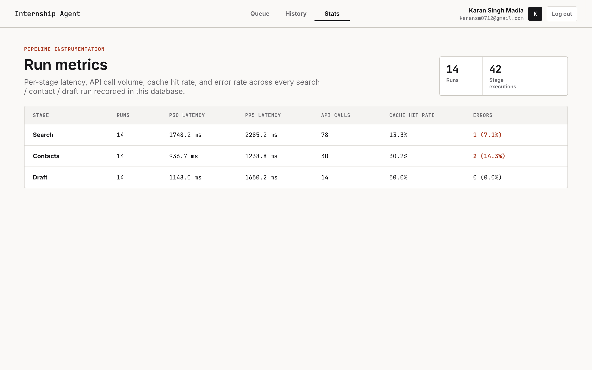

# Internship Agent

I got tired of manually searching for internships, finding the right person to email, and writing a personalized message for each one, so I built a pipeline that does it for me: it searches for live postings, resolves a real hiring contact (not a guessed `careers@` address), drafts a personalized email using my resume, and then waits for me to actually approve it before anything goes out through Gmail. Runs as a local web app or a CLI.

You bring your own Google account and your own Gemini/Tavily/Hunter.io keys. I didn't want to be the one paying for everyone else's API usage, and I didn't want to build something that could send an email without a human looking at it first.

[ARCHITECTURE.md](ARCHITECTURE.md) has the schema, the pipeline diagram, and the actual bugs I hit while building this (a cache-stampede race, a circuit breaker that was itself getting retried).

## Screenshots

### Sign in


### Approval queue


### Company history


### Pipeline stats



## What it does

1. Sign in with Google so the app can send from your Gmail account.
2. Add your own Gemini and Tavily keys, plus an optional Hunter.io key.
3. Upload a resume PDF.
4. Pick locations and roles (or leave both blank to search anywhere, for any tech role).
5. It drafts emails using your resume and the company's details. Candidates get ranked by predicted fit first (see [ARCHITECTURE.md](ARCHITECTURE.md#lead-ranking)), so the strongest matches get drafted before the per-run limit runs out.
6. Review one draft at a time.
7. Click `Send` or `Remove`.
8. It remembers which companies you've already drafted, per Google account, so a re-run doesn't email the same company twice.

If a lead doesn't have a real contact email attached, it lands in a separate `Needs contact` list instead of the send queue — I'd rather show you "couldn't find anyone" than let you send to a guess.

## Engineering

The storage layer used to be five separate JSON files, one of which got rewritten wholesale on every single update. That meant no indexes, and re-running a search replaced your whole leads list instead of adding to it. It's SQLite now — 7 tables, WAL mode, indexed on the columns that actually get queried in a hot path (company lookups, draft status, run metrics). Your API keys and Gmail OAuth token are encrypted at rest with Fernet, scoped to your account, not stored in plaintext like the original version did. Details in [ARCHITECTURE.md](ARCHITECTURE.md#security).

Contact resolution and drafting both run on bounded thread pools instead of a sequential loop, with a token-bucket rate limiter (Hunter's limit is per-account, not per-thread, so this actually matters), retry-with-backoff, a circuit breaker, and a single-flighted cache so two workers hitting the same company at the same time don't both pay for a duplicate lookup. `benchmarks/bench_concurrency.py` measures the thread-pool effect in isolation, against a fake client with fixed simulated latency so it's reproducible without live API keys:

```text
20 companies, 0.3s/call simulated latency
sequential (1 worker):   18.26s
concurrent (5 workers):   3.66s
speedup:                  4.99x
```

Every stage logs its own latency (p50/p95), API call count, cache hit rate, and error rate to SQLite — that's the Stats page above. Before this there was no signal beyond stdout.

Drafting candidates get scored by fit before anything gets written: TF-IDF similarity between your resume and the role description, whether the contact came from Hunter or was guessed, and how confident the extraction was. With no history yet, it falls back to a hand-weighted heuristic; once you've sent, skipped, or removed enough drafts, it trains a small logistic regression on your own history instead. `benchmarks/eval_ranker.py` evaluates that same code on a synthetic labeled set (60 train / 60 held-out) and gets **0.784 ROC-AUC** — for reference, 0.5 is random guessing and 1.0 is perfect separation.

216 pytest tests, 88% coverage, `ruff` and `mypy` both clean. CI runs the Python 3.11–3.13 matrix plus a Docker build.

## Stack

- Python, Flask
- SQLite — see [ARCHITECTURE.md](ARCHITECTURE.md)
- scikit-learn for the lead-ranking model — see [ARCHITECTURE.md](ARCHITECTURE.md#lead-ranking)
- Gemini API for extraction and drafting
- Tavily for web search
- Hunter.io for contact lookup
- Gmail API for approved sends

## Local setup

Install dependencies (`requirements-dev.txt` also gets you pytest/ruff/mypy):

```bash
python3 -m venv .venv && source .venv/bin/activate
pip install -r requirements-dev.txt
```

Set an encryption key for stored API keys and tokens. Without this it falls back to an insecure dev default and prints a warning — fine on `localhost`, not fine for anything you're sharing:

```bash
export INTERNSHIP_AGENT_SECRET_KEY=$(python -c "import secrets; print(secrets.token_urlsafe(32))")
```

Create or update Gmail OAuth credentials:

```bash
python -m internship_agent setup-gmail
```

That asks for your downloaded Google OAuth client JSON and saves it as `credentials.json`, which is gitignored.

Start the web app:

```bash
python web_app.py
```

and open `http://127.0.0.1:5001`.

Your OAuth client needs this redirect URI configured for local login to work:

```text
http://127.0.0.1:5001/oauth2callback
```

### Docker

```bash
docker compose up --build
```

Serves the same app on `http://localhost:5001`, backed by a SQLite file under `./data` on the host. Set `FLASK_SECRET_KEY` / `INTERNSHIP_AGENT_SECRET_KEY` in your shell first if you don't want the dev defaults.

## Google OAuth: Cornell-only / organization-restricted fix

If Google says the app is restricted to your organization, the OAuth consent screen is set to `Internal` — meaning only accounts inside the Google Workspace org that owns the project can authorize it. If that project is under Cornell, that's effectively Cornell accounts only.

To open it up to any Google account:

1. Open Google Cloud Console for the project that owns `credentials.json`.
2. Go to `Google Auth Platform` (or `APIs & Services` → `OAuth consent screen`).
3. Find `Audience` / `User type`.
4. Switch it from `Internal` to `External`.
5. While you're still testing, add specific Google accounts as test users.
6. When you're ready for it to be generally usable, publish to production and complete Google's verification if it's required.

The app only requests the `gmail.send` scope, since sending approved emails is all it needs — but Google treats `gmail.send` as sensitive, so a public production deployment may show an unverified-app warning until you go through OAuth verification.

If your Cornell-owned project won't let you switch to `External`, the workaround is a personal Google Cloud project instead: enable the Gmail API on it, set the consent screen to `External`, create a new OAuth client, download its JSON, and rerun `python -m internship_agent setup-gmail`.

## Bring your own keys

Each signed-in user enters their own keys — Gemini (required for drafting), Tavily (required for search), Hunter.io (optional, improves contact discovery). That's what keeps this from becoming something where I'm footing the API bill for anyone who uses it. Keys and the Gmail OAuth token are encrypted at rest (see [ARCHITECTURE.md](ARCHITECTURE.md#security)) and scoped to the signed-in account they belong to.

## CLI workflow

The original command-line version still works, now as `python -m internship_agent`:

```bash
python -m internship_agent run --resume /absolute/path/to/resume.pdf --limit 15
```

or run it stage by stage:

```bash
python -m internship_agent search --limit 25
python -m internship_agent contacts
python -m internship_agent draft --resume /absolute/path/to/resume.pdf --limit 25
python -m internship_agent send
python -m internship_agent stats   # print aggregate pipeline metrics
```

The CLI's send step previews every email before it goes out:

```text
Send this email? [y]es / [n]o skip / [q]uit:
```

Nothing sends unless you type `y` for that specific draft.

## Testing

```bash
pytest tests -q --cov=internship_agent --cov=web_app --cov-report=term-missing
ruff check internship_agent web_app.py tests
mypy internship_agent web_app.py
```

`tests/unit` covers pure logic and storage in isolation. `tests/integration` runs the real pipeline stages, thread pools included, against mocked Tavily/Gemini/Hunter clients. `tests/web` drives the Flask routes through `app.test_client()`. None of it makes a real network call or needs an API key. `scripts/manual/` is separate — those scripts *do* hit the live APIs, for sanity-checking your own keys by hand, and aren't part of the `pytest` run.

## Generated files

Git-ignored, generated locally:

- `credentials.json`
- `token.json`
- `data/` (including `data/internship_agent.db`, the SQLite database)
- `out/`
- `uploads/`
- `.env`

## Troubleshooting

**`403 Gmail API has not been used... or it is disabled`** — enable the Gmail API in the Google Cloud project that owns `credentials.json`, wait a few minutes for it to propagate, then try again.

**OAuth blocks non-Cornell / non-organization accounts** — switch the OAuth app audience from `Internal` to `External` (see above).

**OAuth blocks a specific account while the app is still in testing mode** — add that account under test users in the OAuth consent screen.

**Gemini quota errors while drafting** — wait for the quota window to reset, or switch to a different Gemini key. Since this is BYO-key, quota is tied to whatever key is currently saved for your account.

## References

- [Google Cloud: Manage app audience](https://support.google.com/cloud/answer/15549945)
- [Google Cloud: Requesting minimum scopes](https://support.google.com/cloud/answer/13807380)
